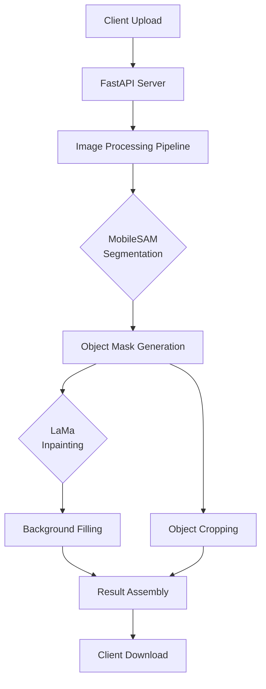

<div align="center">

#  Segmentation & Inpainting API

MobileSAM + LaMa · FastAPI · Real-time Object Removal


[](https://fastapi.tiangolo.com/)
[](https://pytorch.org/)
[](https://www.python.org/)
[](LICENSE)

*Point-and-click object segmentation and removal with AI*

</div>

##  Table of Contents
- [ Features](#-features)
- [ Architecture](#️-architecture)
- [ Quick Start](#-quick-start)
- [ Project Structure](#-project-structure)
- [ API Endpoints](#-api-endpoints)
- [ Installation](#️-installation)
- [ Usage Examples](#-usage-examples)
- [ Configuration](#️-configuration)
- [ Model Details](#-model-details)
- [ Troubleshooting](#️-troubleshooting)
- [ License](#-license)

##  Features

| Feature | Description | Benefit |
|---------|-------------|---------|
| **Point-based Segmentation** | Click on any object to segment it | No bounding boxes needed, intuitive UX |
| **Real-time Inpainting** | Remove objects and fill background | Clean results without manual editing |
| **Batch Processing** | Process multiple objects simultaneously | Efficient for complex scenes |
| **Transparent Crops** | Extract objects with alpha channel | Ready for compositing in other apps |
| **Background Jobs** | Async processing with progress tracking | Handle large images without timeouts |
| **RESTful API** | Standard HTTP endpoints | Easy integration with any frontend |

##  Architecture



##  Quick Start

### Prerequisites
- Python 3.8+
- CUDA-capable GPU (recommended) or CPU
- 4GB+ RAM
- 2GB+ free disk space

### 1-Minute Setup
```bash
# Clone and setup
git clone <repository-url>
cd segmentation-api

# Download MobileSAM checkpoint
wget https://github.com/ChaoningZhang/MobileSAM/releases/download/v1.0/mobile_sam.pt

# Install dependencies
pip install -r requirements.txt

# Start the server
python runserver.py
```

Visit `http://localhost:8000/docs` for interactive API documentation.

##  Project Structure

```
segmentation-api/
├──  jobs/                    # Temporary job storage
│   ├──  {job_id}/           # Per-job directory
│   │   ├── original.png       # Uploaded image
│   │   ├── mask_0.png        # Segmentation mask
│   │   ├── cropped_0.png     # Extracted object (RGBA)
│   │   ├── inpainted_0.png   # Object-removed version
│   │   └── full_inpainted.png # Final cleaned image
├──  main.py                 # FastAPI application
├──  runserver.py           # Server launcher
├──  requirements.txt       # Python dependencies
├──  mobile_sam.pt          # MobileSAM weights
├──  README.md             # This file
└──  LICENSE               # MIT License
```

### File Descriptions

| File | Purpose | Size (approx) |
|------|---------|---------------|
| `main.py` | Core FastAPI application with all endpoints | ~500 lines |
| `runserver.py` | Server startup script with validation | ~30 lines |
| `mobile_sam.pt` | MobileSAM model checkpoint (download separately) | 40MB |
| `requirements.txt` | All Python dependencies | 150+ packages |

##  API Endpoints

### Core Workflow Endpoints

| Endpoint | Method | Description | Request Body | Response |
|----------|--------|-------------|--------------|----------|
| `/upload` | POST | Upload image for processing | `multipart/form-data` (file) | `{job_id, status}` |
| `/segment` | POST | Start segmentation at point | `{job_id, x, y}` | `{job_id, status}` |
| `/status/{job_id}` | GET | Check job progress | - | `{status, progress, ...}` |
| `/download/{job_id}/{filename}` | GET | Download processed files | - | File stream |
| `/cleanup/{job_id}` | DELETE | Remove job data | - | `{status}` |

### Utility Endpoints

| Endpoint | Method | Description |
|----------|--------|-------------|
| `/` | GET | API documentation |
| `/health` | GET | System health check |

##  Installation

### Step-by-Step Setup

1. **Create Virtual Environment**
```bash
python -m venv venv
source venv/bin/activate  # Linux/Mac
# or
venv\Scripts\activate     # Windows
```

2. **Install Dependencies**
```bash
pip install torch torchvision torchaudio --index-url https://download.pytorch.org/whl/cu118
pip install -r requirements.txt
```

3. **Download Model Weights**
```bash
# Option 1: Direct download
wget https://github.com/ChaoningZhang/MobileSAM/releases/download/v1.0/mobile_sam.pt

# Option 2: Manual download
# Visit: https://github.com/ChaoningZhang/MobileSAM
# Download mobile_sam.pt to project root
```

4. **Verify Installation**
```bash
python -c "import torch; print(f'PyTorch: {torch.__version__}')"
python -c "import cv2; print(f'OpenCV: {cv2.__version__}')"
```

##  Configuration

### Environment Variables
Create a `.env` file:
```env
# Server Configuration
PORT=8000
HOST=0.0.0.0
WORKERS=1
LOG_LEVEL=info

# Model Configuration
MAX_IMAGE_SIZE=1024
DEVICE=cuda  # or cpu
MODEL_PATH=./mobile_sam.pt

# Storage Configuration
WORK_DIR=./jobs
CLEANUP_HOURS=24
```

### Runtime Parameters in `main.py`
| Variable | Default | Description |
|----------|---------|-------------|
| `MAX_IMAGE_SIZE` | 1024 | Max dimension for image processing |
| `DEVICE` | cuda/cpu | Torch device (auto-detected) |
| `WORK_DIR` | ./jobs | Temporary storage directory |
| `MOBILE_SAM_CHECKPOINT` | ./mobile_sam.pt | Model weights path |

 
##  Troubleshooting

### Common Issues & Solutions

| Issue | Cause | Solution |
|-------|-------|----------|
| `mobile_sam.pt not found` | Missing model weights | Download from GitHub releases |
| `CUDA out of memory` | GPU memory insufficient | Reduce `MAX_IMAGE_SIZE` or use CPU |
| `Slow processing` | Running on CPU | Enable CUDA or reduce image size |
| `Import errors` | Missing dependencies | Reinstall with `requirements.txt` |
| `API timeout` | Large image processing | Use background jobs, check `/status` |

### Debug Mode
```bash
# Run with verbose logging
python runserver.py 2>&1 | tee debug.log

# Test individual components
python -c "from main import load_models; load_models()"
python -c "import torch; print(torch.cuda.is_available())"
```

### Logging
Check server logs for:
- Model loading status
- Job processing progress
- Error details and tracebacks
- Memory usage statistics

##  License

MIT License

Copyright (c) 2024 Segmentation & Inpainting API Contributors

Permission is hereby granted, free of charge, to any person obtaining a copy
of this software and associated documentation files (the "Software"), to deal
in the Software without restriction, including without limitation the rights
to use, copy, modify, merge, publish, distribute, sublicense, and/or sell
copies of the Software, and to permit persons to whom the Software is
furnished to do so, subject to the following conditions:

The above copyright notice and this permission notice shall be included in all
copies or substantial portions of the Software.

---

